## **_PartB-AWS-App-Runner-and-GitHub-Actions_**
------------------------------------------------------------
### Overview

Hello and welcome! My name is Cecilia, and in this amazing project, I will demonstrate how to use GitHub Actions to deploy a sample application in App Runner as both a source code and an image-based service. 

AWS App Runner is a fully-managed service that makes it easy for developers to quickly deploy containerized web applications and APIs at scale! App Runner can automatically build, scale, and secure the web application in the AWS Cloud. The GitHub Action `amazon-app-runner-deploy` uses the App Runner API to build and deploy the application using the App Runner service with the specified configuration.


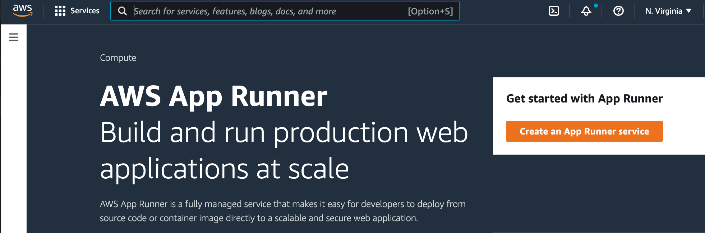

--------------------------------------------------------------------------
### PART 1: Getting Started

Let's get started by ensuring that our computer system is up-to-date with the latest tools and software needed for this project.

**PRE-REQUISITES**

- New or existing [GitHub account](https://github.com/)
    - Create a new GitHub repository and then clone it to your local environment. For this example, create a repository called `github-actions-with-app-runner`

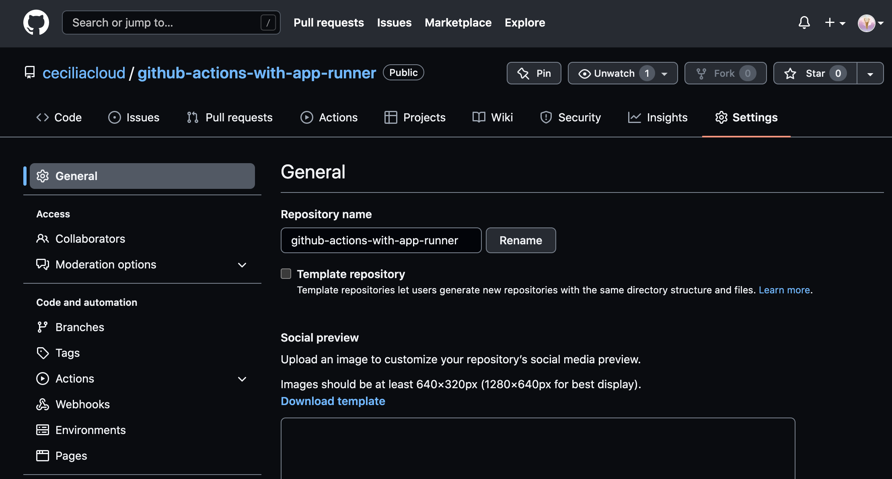

- Install [AWS Command Line Interface](https://docs.aws.amazon.com/en_pv/cli/latest/userguide/cli-chap-install.html) (AWS CLI) locally. 
_**PLEASE NOTE:** Alternatively, you may use [AWS Cloud9](https://aws.amazon.com/cloud9/) as your integrated development environment (IDE), AWS CLI is pre-installed._
- Install `node` and `npm` in your local environment. See [Node.js & npm](https://docs.npmjs.com/downloading-and-installing-node-js-and-npm) for more detailed steps.
- An AWS user with access keys. See [AWS Access/Secret keys](https://docs.aws.amazon.com/general/latest/gr/aws-sec-cred-types.html#access-keys-and-secret-access-keys).
- For source-based deployment, the App Runner service requires access to the source image repository. See [documentation](https://docs.aws.amazon.com/dtconsole/latest/userguide/connections-create-github.html).
- Set up App Runner service permissions. See [IAM Policies & Roles](https://docs.aws.amazon.com/apprunner/latest/dg/security_iam_service-with-iam.html#security_iam_service-with-iam-roles).


--------------------------------------------------------------------------
### PART 2: Adding Permissions

In this section, we will create a service role and then associate the `AWSAppRunnerServicePolicyForECRAccess` policy with permissions.

1. Create `trust-policy.json` file using the `touch` command, then write the following into the trust policy:
    
```json
{
    "Version": "2012-10-17",
    "Statement": [
    {
        "Effect": "Allow",
        "Principal": {
        "Service": "build.apprunner.amazonaws.com"
        },
        "Action": "sts:AssumeRole"
    }
    ]
}
```

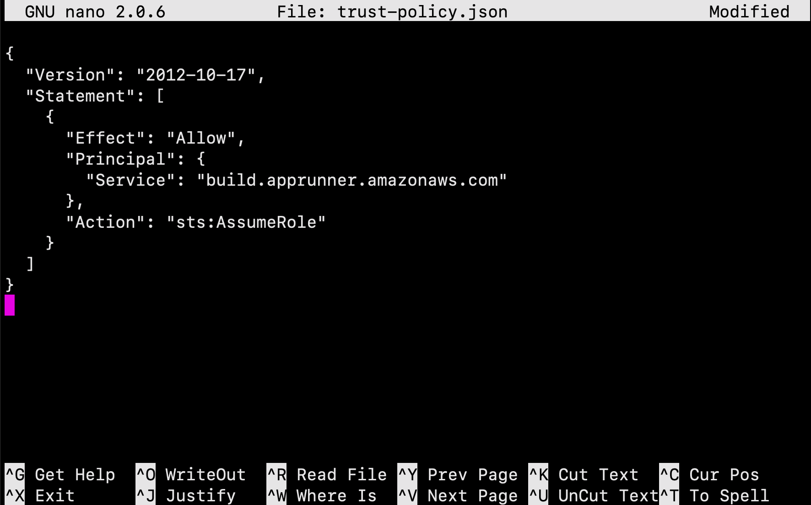

    
2. Create new role `app-runner-service-role` with `trust-policy.json`:
    
```bash
$ aws iam create-role --role-name app-runner-service-role \
--assume-role-policy-document file://trust-policy.json
```
    
3. Attach `AWSAppRunnerServicePolicyForECRAccess` IAM policy to `app-runner-service-role` IAM role:
    
```bash
$ aws iam attach-role-policy \
--policy-arn arn:aws:iam::aws:policy/service-role/AWSAppRunnerServicePolicyForECRAccess \
--role-name app-runner-service-role
```

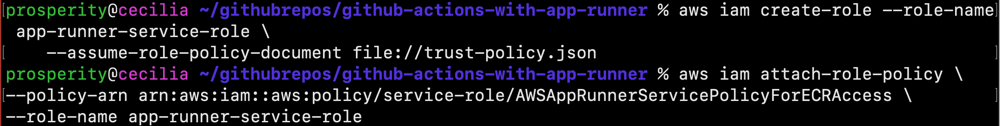

--------------------------------------------------------------------------
### PART 3: Configuring GitHub Secrets

In order to access your AWS account, the GitHub Actions CI/CD pipeline requires AWS credentials. For security purposes, the credentials must include [AWS Identity and Access Management (IAM)](https://aws.amazon.com/iam/) policies that provide access to App Runner and IAM resources.

These credentials are stored as GitHub secrets within your GitHub repository, which is located at the **Settings > Secrets** section.

Create the following `secrets` in your GitHub repository:

1. Create two secrets named: `AWS_ACCESS_KEY_ID` and `AWS_SECRET_ACCESS_KEY` and enter the corresponding key values. 

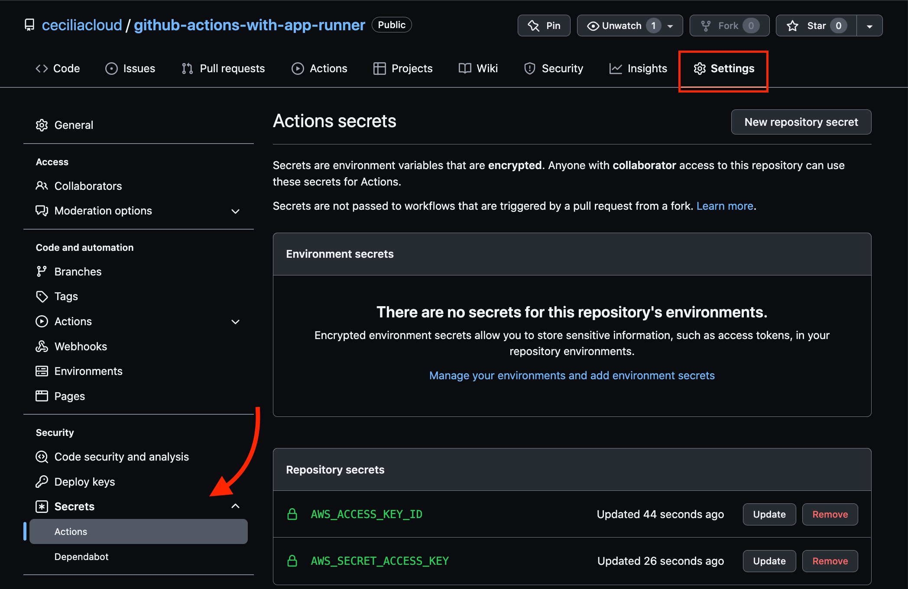

These key values can be located at the IAM service on the AWS management console. Navigate to the IAM user, and locate the `Access Keys` section.

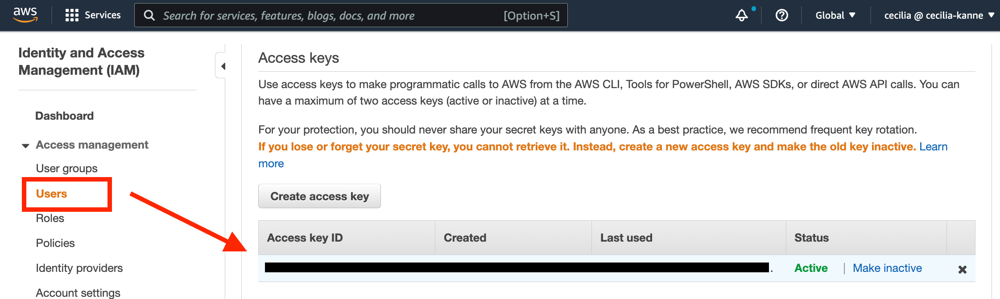

**PLEASE NOTE** 
  It is recommended to follow IAM best practices for the AWS credentials used in GitHub Actions workflows, including:
  1. **Do not store credentials in your repository code**. Use [GitHub Actions secrets](https://docs.github.com/en/actions/security-guides/encrypted-secrets) to store credentials and redact credentials from GitHub Actions workflow logs.

2. [Create an individual IAM user](https://docs.aws.amazon.com/IAM/latest/UserGuide/best-practices.html#create-iam-users) with an access key for use in GitHub Actions workflows, preferably one per repository. Do not use the AWS account root user access key.

Next, create an OpenID Connect (OIDC) identity provider in your AWS Account. This will connect AWS and GitHub, so they can exchange tokens.

- Navigate to the **IAM console > Identity providers**
- Click `Add new provider`
- Select OpenID Connect
- Provider URL: https://token.actions.githubusercontent.com
- Click `Get Thumbprint`
- Audience: `sts.amazonaws.com`
- Click `Add Provider`

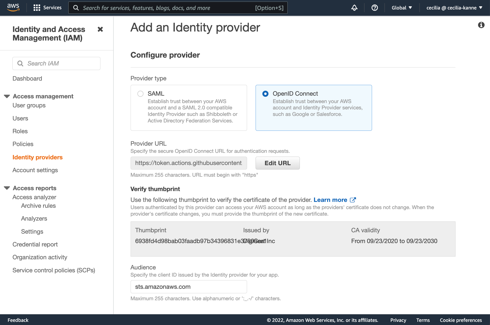

Next, create a role that GitHub will be able to assume, in order to access the resources it needs to control.

- Go back to IAM and select `Roles`, then click `Create role`.

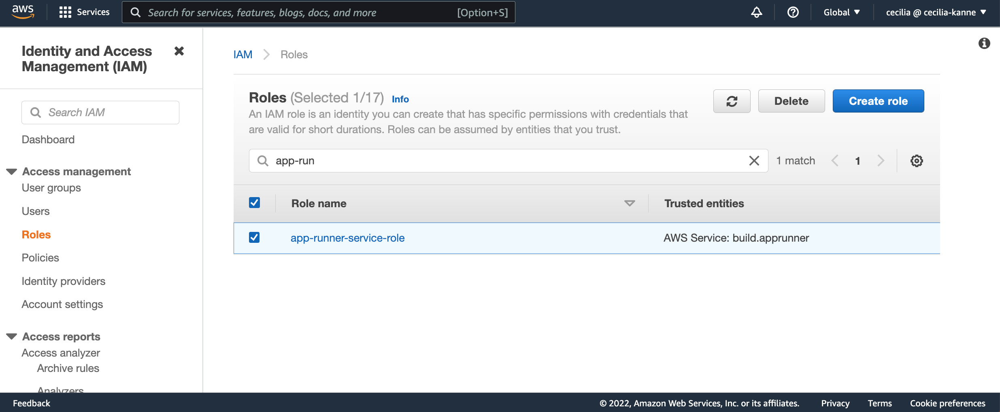

- Chose Web Identity, select the Identity provider you created in the previous step, and its audience.

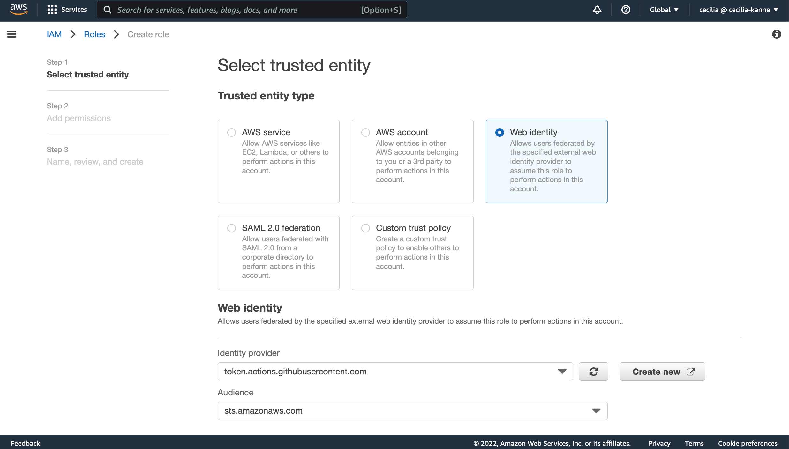

- Click `Next` to add permissions.
- Click `Review`, then add a name/description for the role.
- Click `Create role` at the bottom of the screen.

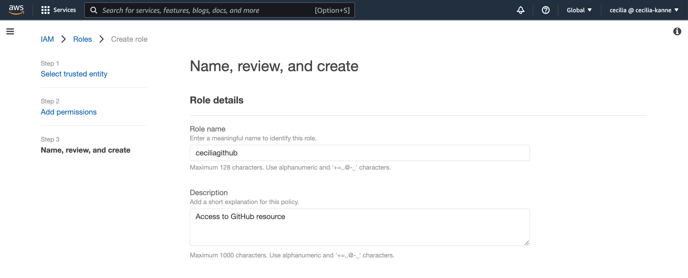

Great job! Next, we must edit the trust policy of the role to reduce its scope to your repository. 

- Navigate to the IAM Roles and select the created Role. Choose **Trust Relationships** and Edit **Trust Relationship**. 

- Paste the following into the JSON text editor. 

**IMPORTANT**: Remember to replace `AwsAccountNumber` with the actual AWS Account number:
        
```json
{
    "Version": "2012-10-17",
    "Statement": [
        {
            "Sid": "VisualEditor0",
            "Effect": "Allow",
            "Action": "apprunner:*",
            "Resource": "*"
        },
        {
            "Sid": "VisualEditor1",
            "Effect": "Allow",
            "Action":[
                "iam:PassRole",
                "iam:CreateServiceLinkedRole"
            ],
            "Resource": "*"
        },
        {
            "Sid": "VisualEditor2",
            "Effect": "Allow",
            "Action": "sts:AssumeRole",
            "Resource": "arn:aws:iam::<AWSAccountNumber>:role/app-runner-service-role"
        },
        {
            "Sid": "VisualEditor3",
            "Effect": "Allow",
            "Action": [
                "ecr:GetDownloadUrlForLayer",
                "ecr:BatchGetImage",
                "ecr:BatchCheckLayerAvailability",
                "ecr:PutImage",
                "ecr:InitiateLayerUpload",
                "ecr:UploadLayerPart",
                "ecr:CompleteLayerUpload",
                "ecr:GetAuthorizationToken"
            ],
            "Resource": "*"
        }
    ]
}
```

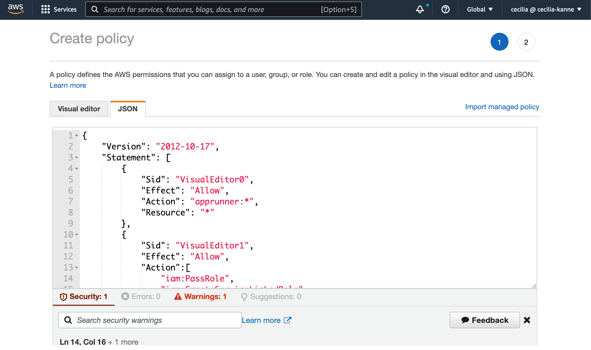

**PLEASE NOTE:** To ensure best security practices, it is important to regularly perform the following tasks: 

1. [Rotate the credentials](https://docs.aws.amazon.com/IAM/latest/UserGuide/best-practices.html#rotate-credentials) used in GitHub Actions workflows regularly.
2. [Monitor the activity](https://docs.aws.amazon.com/IAM/latest/UserGuide/best-practices.html#keep-a-log) of the credentials used in GitHub Actions workflows.


Next, on GitHub, create three additional secrets:
- `AWS_REGION`: enter the Region where the App Runner service needs to be created.
- `AWS_CONNECTION_SOURCE_ARN`: enter the Amazon Resource Name (ARN) of the source code connector in App Runner.
- `ROLE_ARN`: enter the ARN of the IAM role that grants access to the source image repository.

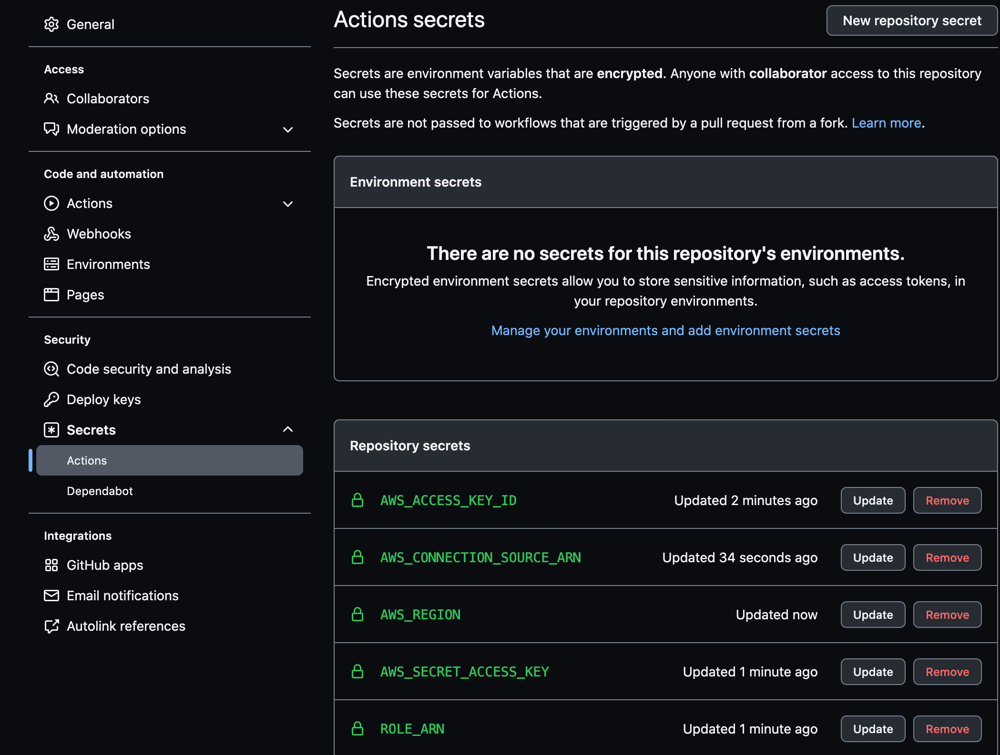

**PLEASE NOTE** 
To locate the `ROLE_ARN`, navigate to the IAM service on the AWS management console. Copy the ARN of the app runner service role that was created in the previous steps.

To locate the `AWS_CONNECTION_SOURCE_ARN`, navigate to the `AWS App Runner` service on the AWS management console. Create a new App Runner service and follow the prompts. Once completed, copy the ARN from the GitHub connections page:

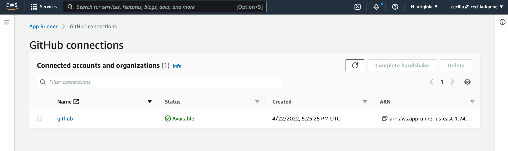

--------------------------------------------------------------------------
### PART 4: Creating the Application

This GitHub Action supports two types of App Runner services: 
1. source code-based  
2. container image-based. 

In this section, I will demonstrate how we can use these different methods to deploy the sample application in App Runner.

- Begin by create a package.json inside the root directory file by running the `npm init` command. Accept all the default values by pressing `Enter` on your keyboard.

```
$ npm init
```

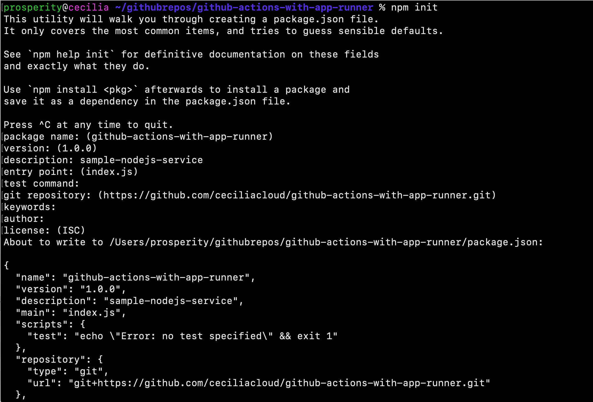

    
- Next, add the `Express` dependency by running the following command:

```
$ npm install express
```

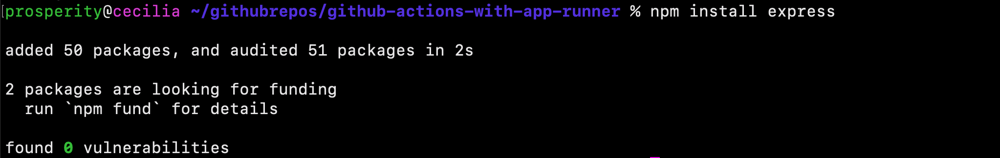

    
- Using your code-editor of choice, access the `package.json` file and add the following "start" script. 

```json
"scripts": {
    "start": "node index.js"
}
```

- Remove the default `test` line from the `scripts` definition. Save and close the file when complete.
    
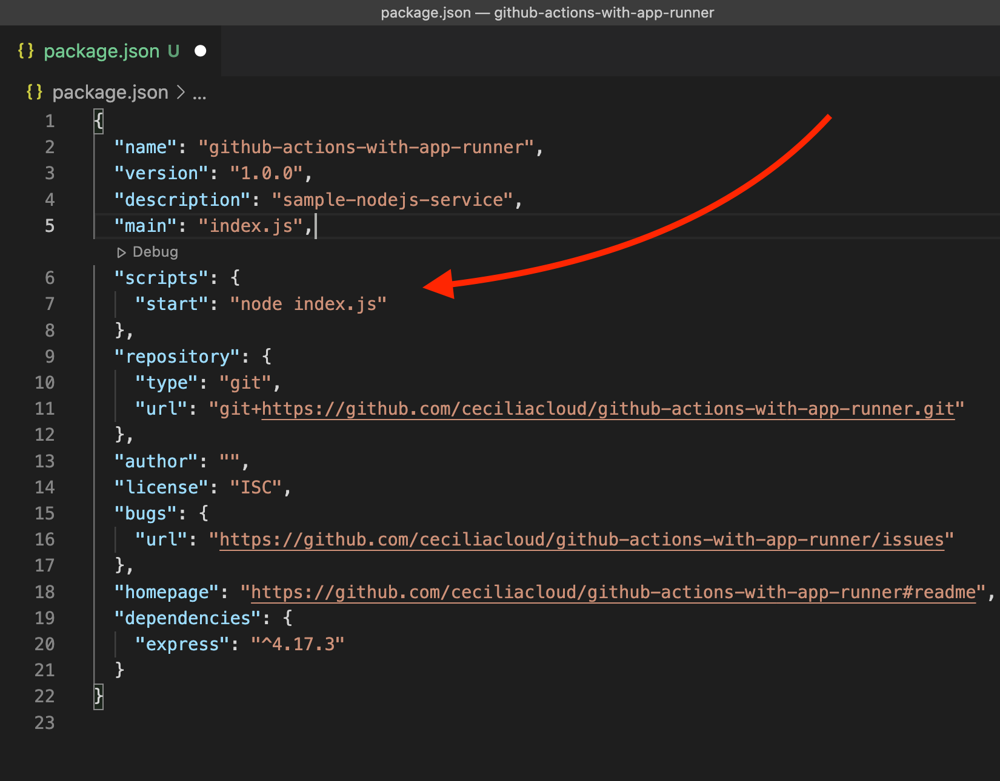

    
- Next, create an `index.js` file inside the same directory and add the following code:
    
    ```jsx
    const express = require('express');
    const app = express();
    
    app.get('/', (req, res) => {
        res.send('Running on AWS App Runner Service !');
    });
    
    const PORT = process.env.PORT || 8080;
    app.listen(PORT, () => {
        console.log(`Server listening on port ${PORT}...`);
    });
    ```

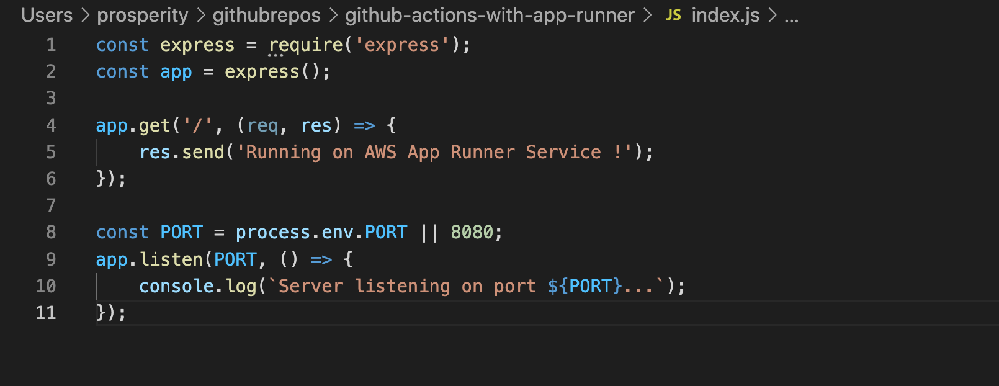


- To start the application, run the following command:

```
$ npm start
```

- Open the browser and navigate to [http://localhost:8080](http://localhost:8080/)

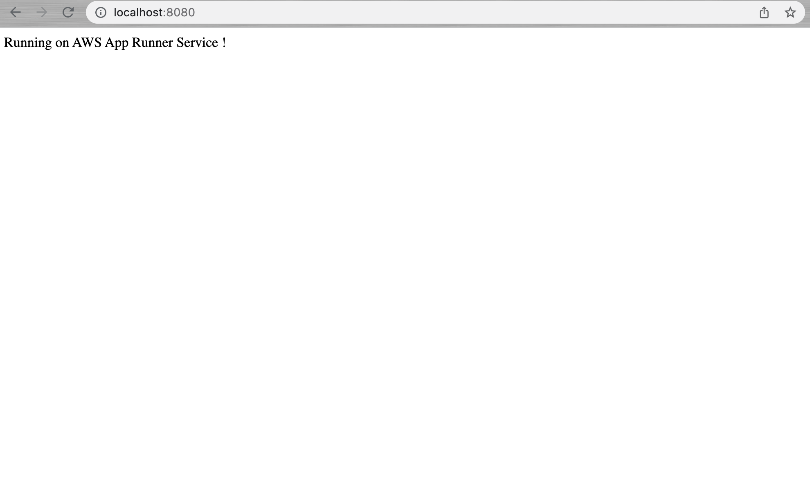

--------------------------------------------------------------------------

### PART 5: Deploying the sample application

Excellent work! Now we will deploy the sample application.

- First, create a new directory `.github/workflows` under the root directory
- Next, create a new file `pipeline.yml` under the `.github/workflows`.
- Edit the pipeline.yml file and add the following:

```bash
name: Deploy to App Runner - Source # Name of the workflow
on: push: branches: [ main ] # Trigger workflow on git push to main branch workflow_dispatch: # Allow manual invocation of the workflow
jobs: deploy: runs-on: ubuntu-latest steps: - name: Configure AWS credentials uses: aws-actions/configure-aws-credentials@v1 # Configure with AWS Credentials with: aws-access-key-id: ${{ secrets.AWS_ACCESS_KEY_ID }} aws-secret-access-key: ${{ secrets.AWS_SECRET_ACCESS_KEY }} aws-region: ${{ secrets.AWS_REGION }} - name: Deploy to App Runner id: deploy-apprunner uses: awslabs/amazon-app-runner-deploy@main # Deploy app runner service with: service: app-runner-git-deploy-service source-connection-arn: ${{ secrets.AWS_CONNECTION_SOURCE_ARN }} repo: https://github.com/${{ github.repository }} branch: ${{ github.ref }} runtime: NODEJS_12 build-command: npm install start-command: npm start port: 18000 region: ${{ secrets.AWS_REGION }} cpu : 1 memory : 2 wait-for-service-stability: true - name: App Runner output run: echo "App runner output ${{ steps.deploy-apprunner.outputs.service-id }}"
```
This configuration triggers the GitHub Actions CI/CD pipeline when code is pushed to the main branch!

- Next, create `.gitignore` file under git root directory and add `node_modules` to the list of excluded folders.
- Lastly, add all the files to your local git repository, commit the changes, and push to GitHub by running the following command from the root directory:
    
```bash
$ git add .
$ git commit -am "Initial commit with pipline"
$ git push
```

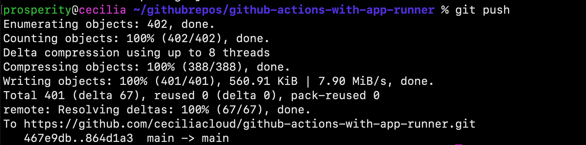


Once the files are pushed to GitHub on the main branch, this automatically triggers the GitHub Actions workflow as configured in the `pipeline.yml` file. 

You can check the status of the workflow on the [AWS App Runner service](https://console.aws.amazon.com/apprunner/home) of the AWS management console. 

Upon completion, the App Runner service will be created in the specified AWS Region successfully!

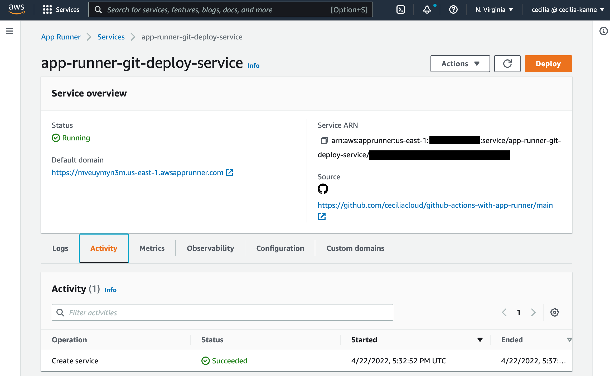


#### Testing the application

- Great job! You can now examine the newly created service with the `app-runner-git-deploy-service` name configured.
    
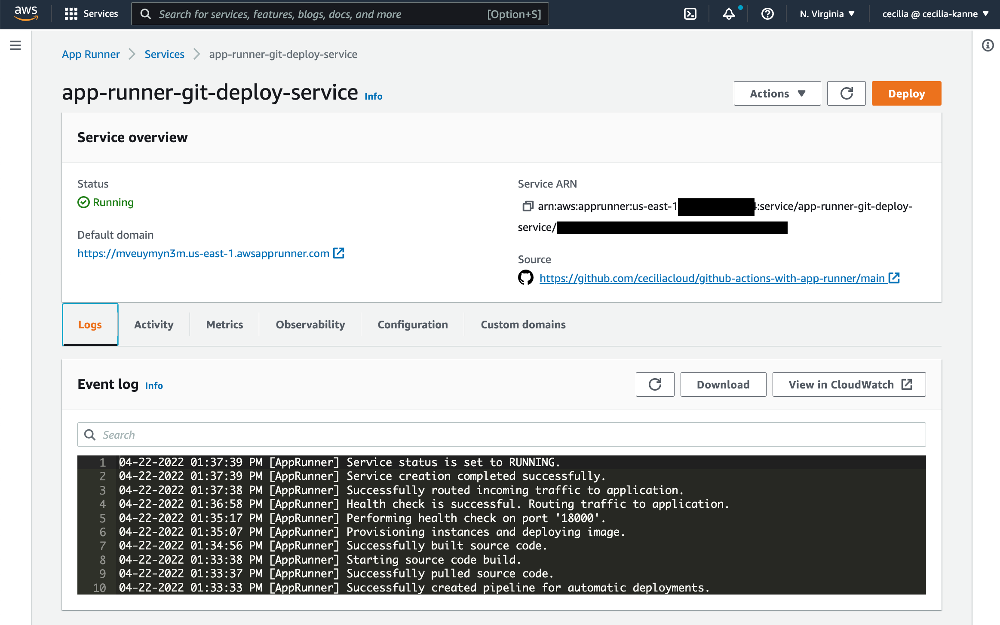

    
- Next, open your web browser and navigate to the URL mentioned following the `Default domain` section. You should see the service up and running!

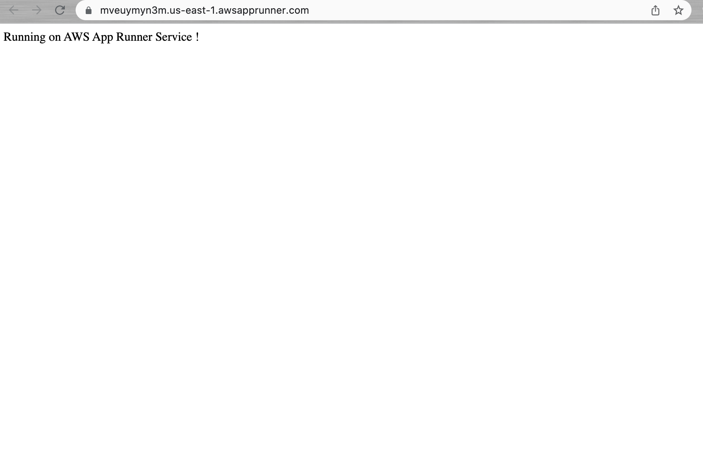

--------------------------------------------------------------------------
### PART 6: Image-based service

In this section, I will demonstrate how we can build the Docker image and push the generated image to Amazon ECR using the `aws-actions/amazon-ecr-login@v1` action.

Once the image is available in Amazon ECR, `awslabs/amazon-app-runner-deploy@main` will create a new App Runner service and deploy the application inside the container.

- Begin by creating a Dockerfile inside the root directory and add the following lines to the file:

```docker
FROM node:12-slim
WORKDIR /usr/src/app
COPY package*.json ./
COPY index.js ./
RUN npm ci
COPY . .
EXPOSE 8080
CMD [ "node", "index.js" ]
```

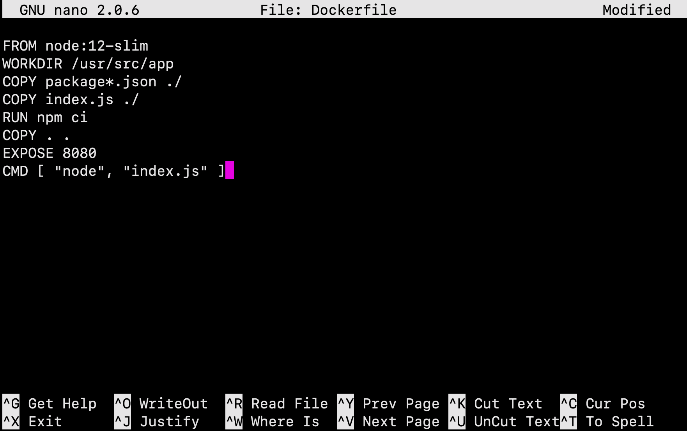


- Next, run the following command to create an Amazon ECR repository

```
$ aws ecr create-repository --repository-name nodejs
```

**IMPORTANT**
**Before proceeding to next step, remove the following files/folders:**
- `node_modules`
- `.github/workflow/pipeline.yml`


Next, create a file under `.github/workflow` with the name: `image-pipeline.yml` 
- Add the following contents to the `image-pipeline.yml` file:

```yaml
name: Deploy to App Runner - Image based # Name of the workflow
on:
  push:
    branches: [ main ] # Trigger workflow on git push to main branch
  workflow_dispatch: # Allow manual invocation of the workflow
jobs:  
  deploy:
    runs-on: ubuntu-latest
    
    steps:      
      - name: Checkout
        uses: actions/checkout@v2
        with:
          persist-credentials: false
          
      - name: Configure AWS credentials
        id: aws-credentials
        uses: aws-actions/configure-aws-credentials@v1
        with:
          aws-access-key-id: ${{ secrets.AWS_ACCESS_KEY_ID }}
          aws-secret-access-key: ${{ secrets.AWS_SECRET_ACCESS_KEY }}
          aws-region: ${{ secrets.AWS_REGION }}     

      - name: Login to Amazon ECR
        id: login-ecr
        uses: aws-actions/amazon-ecr-login@v1        

      - name: Build, tag, and push image to Amazon ECR
        id: build-image
        env:
          ECR_REGISTRY: ${{ steps.login-ecr.outputs.registry }}
          ECR_REPOSITORY: nodejs
          IMAGE_TAG: ${{ github.sha }}
        run: |
          docker build -t $ECR_REGISTRY/$ECR_REPOSITORY:$IMAGE_TAG .
          docker push $ECR_REGISTRY/$ECR_REPOSITORY:$IMAGE_TAG
          echo "::set-output name=image::$ECR_REGISTRY/$ECR_REPOSITORY:$IMAGE_TAG"  
          
      - name: Deploy to App Runner
        id: deploy-apprunner
        uses: awslabs/amazon-app-runner-deploy@main        
        with:
          service: app-runner-image-deploy-service
          image: ${{ steps.build-image.outputs.image }}          
          access-role-arn: ${{ secrets.ROLE_ARN }}
          runtime: NODEJS_12          
          region: ${{ secrets.AWS_REGION }}
          cpu : 1
          memory : 2
          port: 8080
          wait-for-service-stability: true
      
      - name: App Runner output
        run: echo "App runner output ${{ steps.deploy-apprunner.outputs.service-id }}" 
```

**PLEASE NOTE:** Please ensure that the  appropriate values are set for the following GitHub Secrets:
- `AWS_ACCESS_KEY_ID`
- `AWS_SECRET_ACCESS_KEY`
- `AWS_REGION`
- `ROLE_ARN`

- Next, add all the files to your local git repository, commit the changes, and push to GitHub

```bash
$ git add .
$ git commit -am "Initial commit with image pipline"
$ git push
```

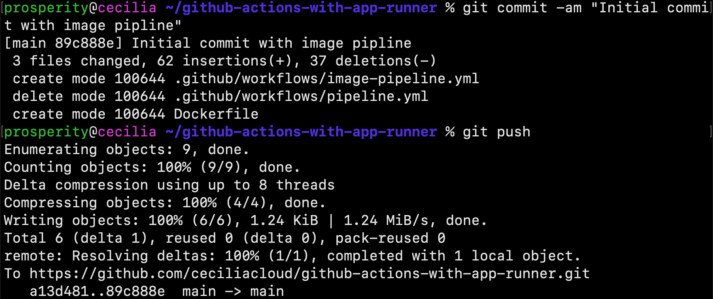


Once the files are pushed to GitHub on the main branch, this automatically triggers the GitHub Actions workflow as configured in the `image-pipeline.yml` file. 


Once again, the pipeline execution will take couple of minutes to complete. 

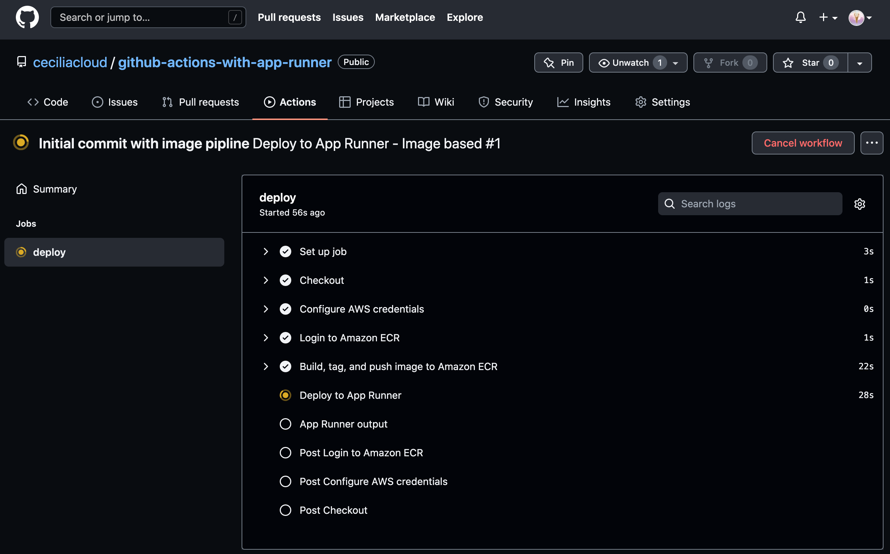


Upon completion, the App Runner service will be created in the specified AWS Region successfully!

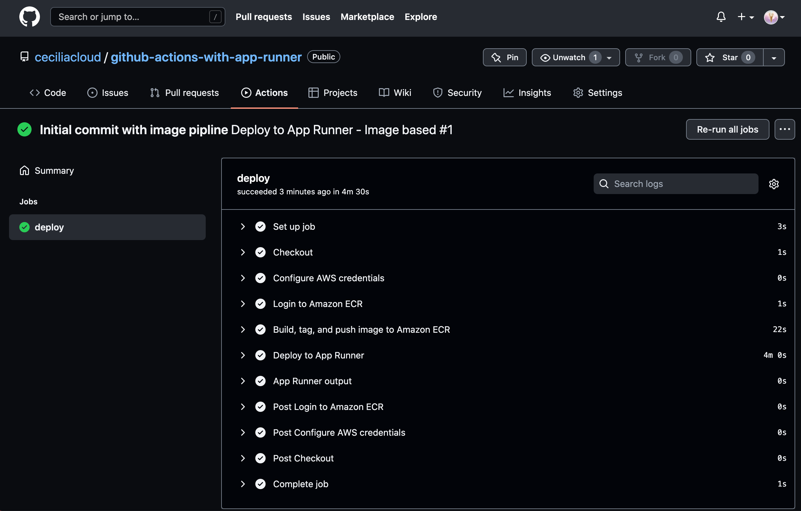

#### Testing the application

- Log in to the [App Runner console](https://console.aws.amazon.com/apprunner/home), and you should see a new service with the `app-runner-image-deploy-service` name configured!

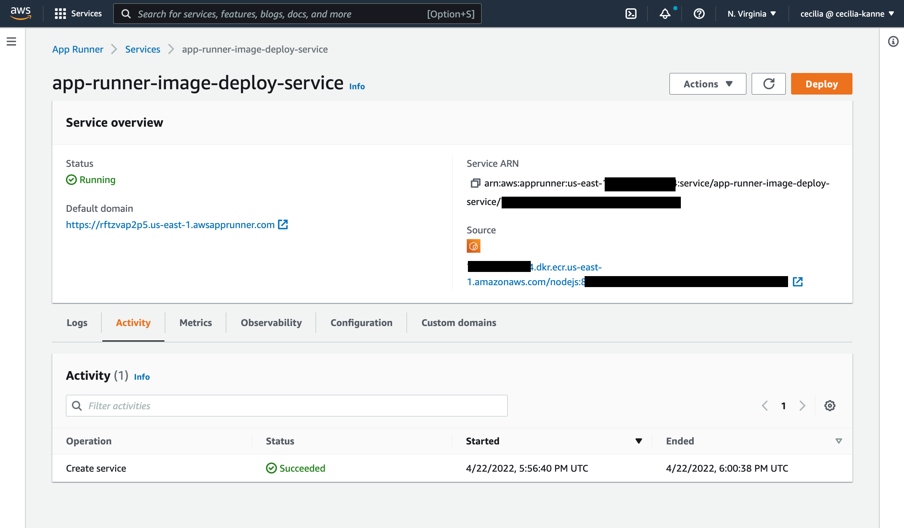

    
- Open the browser and navigate to URL mentioned following the `Default domain` section in the console. You should see the service up and running.

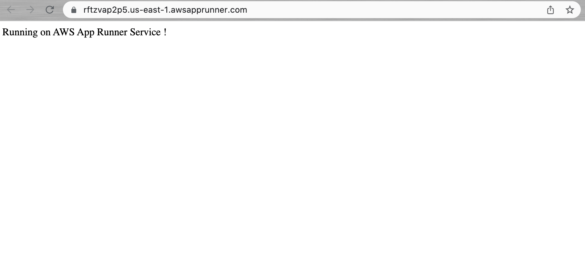

Great job! We have successfully created 2 services in our App Runner deployment.

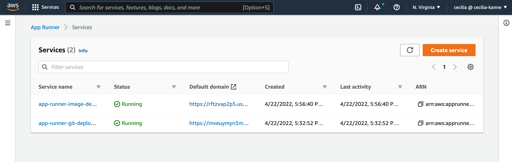


--------------------------------------------------------------------------
### Cleanup

To avoid incurring future charges, delete all of the resources!

- Log in to the [App Runner console](https://console.aws.amazon.com/apprunner/home), select the `app-runner-image-deploy-service` service, and select **Actions → Delete**. Repeat the same for `app-runner-git-deploy-service` service, as well.

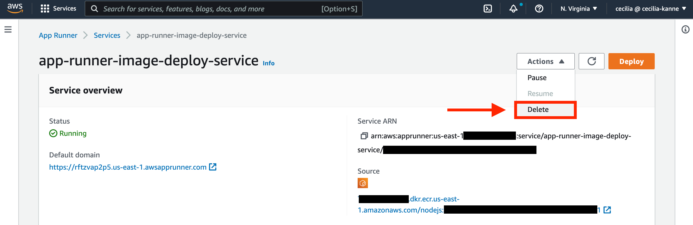


- Delete the Amazon ECR repository by running the following command:

```
$ aws ecr delete-repository \ --repository-name nodejs \ --force
```

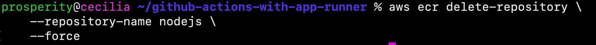


- Next, delete the `IAM role` by running the following commands:

    _Detach IAM policy_

    ```
    $ aws iam detach-role-policy \-policy-arn arn:aws:iam::aws:policy/service-role/AWSAppRunnerServicePolicyForECRAccess \-role-name app-runner-service-role
    ```

    _Delete IAM role_

    ```
    $ aws iam delete-role --role-name app-runner-service-role
    ```
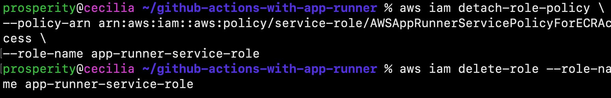

- Delete the existing “GitHub connection” on the App Runner service.

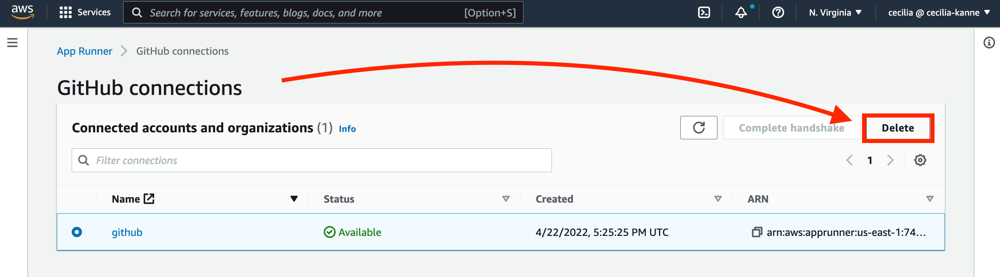

- Deactivate and remove the IAM user's AWS access key and AWS secrets


----------------------------------------------------------------------

Wonderful job! Thank you for viewing my project and following along. We learned how organizations using GitHub as a source code repository can use GitHub Actions to deploy their applications on App Runner.

I hope you enjoyed it! For more details on similar projects and more, please visit my GitHub portfolio: https://github.com/ceciliacloud

